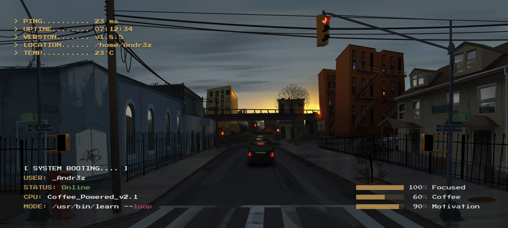

# *About me*

I am an undergraduate **Software Development Technology** student at Universidad del Valle, Palmira. Java, Python, JavaScript, HTML, and CSS are the programming languages I am good at. I love to learn and build something new, productive, innovative, and creative.

* **I am interested in Web development, Cloud deployment, and UI design**
- 🌱 I’m currently learning ...
  - React js
- 👯 I’m looking forward to collaborate on open source projects.
- ✔ Ask me about anything, I am happy to help, only if the ball is in my court!😉 
- Outside tech: 🎮 I enjoy playing video games, 📖 reading manga, and 🎬 watching movies.
- 📫 Reach out to me at: <a href="miguel.andres.dev@gmail.com">miguel.andres.dev@gmail.com</a>

 

<!--START_PROGRESS-->
🚀 Year progress ▰▰▰▰▰▰▰▰▰▰▱▱ 90.71%
<!--END_PROGRESS-->

## &nbsp;🛠 Tech Stack

### **Backend & DevOps**

### **Frontend**

---

## &#x1f4c8; GitHub Stats

